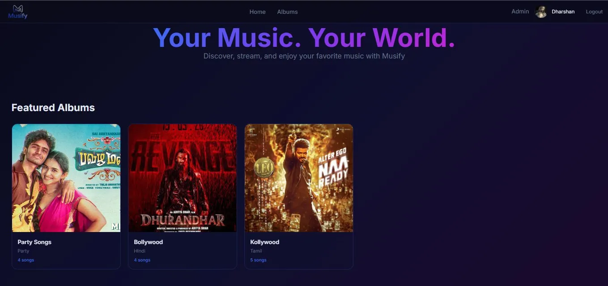

# 🎵 Musify V2

> Your Music. Your World.

A full-stack music streaming web app built with React 19, Firebase, and Cloudinary. Features a sleek dark UI, Firebase authentication, an admin panel for uploading albums and songs, and a mini player with full playback controls.



## ✨ Features

- 🎧 Browse and stream albums and songs
- 🔐 Firebase Authentication (Login, Register, Forgot Password)
- 🛠️ Admin panel — upload songs, manage albums
- ☁️ Cloudinary image uploads for album art and profile photos
- 👤 User profile dashboard with settings
- 🎵 Mini player with playback controls
- 📱 Responsive design

## 🛠 Tech Stack

| Technology | Purpose |
|---|---|
| React 19 + Vite 6 | Frontend framework & build tool |
| Tailwind CSS v4 | Styling |
| Framer Motion | Animations |
| Firebase Auth + Firestore + Storage | Authentication & database |
| Cloudinary | Media storage |
| React Router v7 | Client-side routing |

## 🚀 Getting Started

1. Clone the repo
```bash
   git clone https://github.com/Dharshan-ui/Musify-V2.git
   cd Musify-V2
```

2. Install dependencies
```bash
   npm install
```

3. Create a `.env` file based on `.env.example`
```bash
   cp .env.example .env
```
   Fill in your Firebase and Cloudinary credentials.

4. Start the dev server
```bash
   npm run dev
```

## 🔐 Environment Variables

| Variable | Description |
|---|---|
| `VITE_FIREBASE_API_KEY` | Firebase API key |
| `VITE_FIREBASE_AUTH_DOMAIN` | Firebase auth domain |
| `VITE_FIREBASE_PROJECT_ID` | Firebase project ID |
| `VITE_FIREBASE_STORAGE_BUCKET` | Firebase storage bucket |
| `VITE_FIREBASE_MESSAGING_SENDER_ID` | Firebase messaging sender ID |
| `VITE_FIREBASE_APP_ID` | Firebase app ID |
| `VITE_CLOUDINARY_CLOUD_NAME` | Cloudinary cloud name |
| `VITE_CLOUDINARY_UPLOAD_PRESET` | Cloudinary upload preset |
